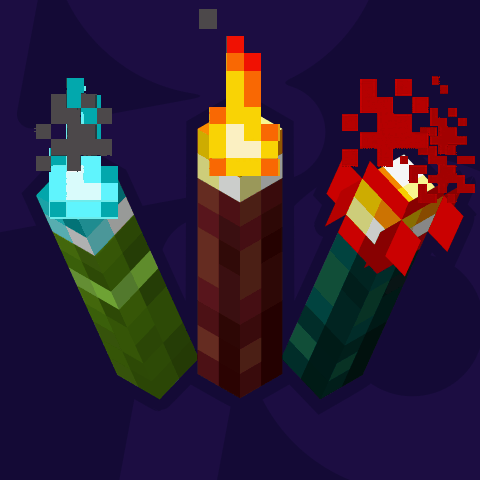

#  More Torch Variants
> 
>
> A simple mod adding wood variants for Minecraft's Torch.

### Compatibility

- Minecraft: `1.20.1`, `1.21(.1)`, `1.21.4`~`1.21.8`
- Mod Loader: _Fabric_
- Requires: [`Fabric API`](https://modrinth.com/mod/fabric-api), [ `More Stick Variants (MStV)`](https://modrinth.com/mod/more-stick-variants)

### ᴬ⃯ ᵦ⃔ Translations

Currently available in:
- English
- German
- Ukrainian (@StarmanMine142 with PR #4, added in `1.1.3`)

Want to help translate? Feel free to open a PR to the **default branch (`1.21(.1)`)**.

### Changelog History

<!--CHANGELOG:START-->
### 1.1.7
- Added compatibitility with [Torchified resource pack](https://www.modrinth.com/resourcepack/torchified)
- Fix incompatibility with 0.17.x versions of Fabric Loader### 1.1.5:
- `1.21.4+`: Fix broken models for any resource pack
### 1.1.3:
- Add Ukrainian Translation (Thanks to [Starman](https://modrinth.com/user/StarmanMine142))
### 1.1.1:
- Revert changes from version `1.0.7` that unexpectedly broke the crafting recipe of Oak (/Vanilla) Torches
## 1.1.0:
- `1.21.3`, `1.21.4`: Add Pale Oak Torches
### 1.0.7:
- Add missing recipes for Lantern, Soul Lantern and Jack o'Lantern (thanks to [Vehru](https://www.curseforge.com/members/vehru) for pointing it out)
- (Re)move all recipes of this mod out of the minecraft namespace for better compatibility
### 1.0.6:
- Add support for [tr7zw](https://modrinth.com/user/tr7zw)'s [Not Enough Animations](https://modrinth.com/mod/not-enough-animations)(/[First Person Model](https://modrinth.com/mod/first-person-model))
- `1.21.4`; Update to `1.21.4`
### 1.0.5:
- Fix broken Redstone Torch Variant models when placed on sides of blocks
### 1.0.4:
- Fix broken crafting recipes on `1.21.2`, `1.21.3`
### 1.0.3:
- `1.21.2`, `1.21.3`: Update to `1.21.2`, `1.21.3`
- Fix Dark Oak Torch names not properly declaring their torch type
### 1.0.2:
- Fix crash when using this mod on a server
### 1.0.1:
- Add `wall_torches` to block tags, so Piglins get properly scared by and **Quad** `1.3.0+` can replace (soul) torches placed on walls
# 1.0.0<!--CHANGELOG:END-->

> _This section is automatically updated with each new release and only includes already published releases._

#### Support/Contact
- Suggestions? Questions? Bug reports?  
Feel free to [open an issue](https://github.com/pnk2u/More-Torch-Variants/issues)!  
&nbsp;  
You can also contact me via email at [contact@pnku.de](mailto:contact@pnku.de) or join the [Discord](https://dsc.lieonlion.dev) and contact me there.
